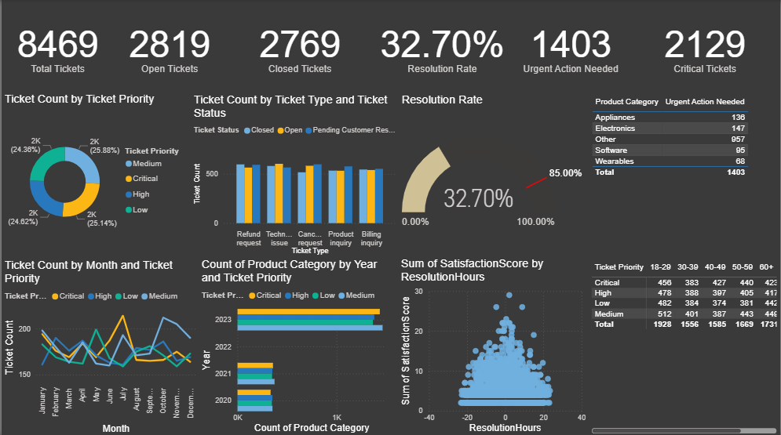

# 📊 Customer Support Ticket Dashboard – Power BI

This Power BI project analyzes customer support ticket data to uncover insights into response time performance, ticket resolution efficiency, and customer satisfaction. The goal is to help support teams monitor key KPIs, identify bottlenecks, and improve overall service quality.

---

## 📁 Project Structure

Customer-Support-Ticket-BI/
├── Customer_Support_Ticket_BI.pbix # Main Power BI report
├── data/
│ └── sample_data.csv # Sample data used in the report
├── visuals/
│ └── dashboard_screenshot.png # Screenshot of the dashboard
└── dax_formulas.md # DAX calculations used in the report

---

## 🧠 Key Insights & Features

- ✅ **Resolved vs Unresolved Tickets**: Visual breakdown of tickets by status
- ⏱️ **Time Metrics**: First response time, time to resolution, and their averages
- 📈 **Performance Tracking**: SLA metrics and customer satisfaction ratings (CSAT)
- 🧹 **Data Cleaning**: Null handling, date formatting, and duration calculation
- 📊 **Interactive Filters**: Priority level, ticket status, date range, and more

---

## 📷 Dashboard Preview

  

---

## 🧮 DAX Measures Used

The report includes several calculated columns and measures, such as:

- `Resolved Tickets`
- `ResolutionHours_Clean`
- `CSAT_Score_Percentage`
- `Open_Tickets`
- `ResponseWithinSLA`
- `Average Response Time`
- `Average Resolution Time`

> 💡 Full list available in [`dax_formulas.md`](dax_formulas.md)

---

## 🔧 Tools Used

- **Power BI Desktop**
- **DAX (Data Analysis Expressions)**
- **Power Query Editor**
- **CSV data (Sample)**
- **Data Modeling & Time Intelligence**

---

## 🚀 How to Use This Project

1. Clone or download this repository:
   ```bash
   git clone https://github.com/yourusername/Customer-Support-Ticket-BI.git
2. Open the .pbix file in Power BI Desktop:

   Customer_Support_Ticket_BI.pbix

3. Replace or connect your own dataset if needed (optional):

   Update the data source in Power Query

4. Explore, customize visuals, and publish to Power BI Service if desired

🧪 Use Cases
  Analyze customer support performance over time

  Identify delays or SLA violations

  Monitor CSAT scores to improve service delivery

  Optimize support team operations based on historical data

🤝 Contributing
   If you'd like to contribute improvements or ideas to this dashboard, feel free to fork the repo and submit a pull request.

📩 Contact
   Created by Aszad Raza
📧 Email: raszad75@gmail.com
🔗 LinkedIn: (https://www.linkedin.com/in/aszad-raza/)
